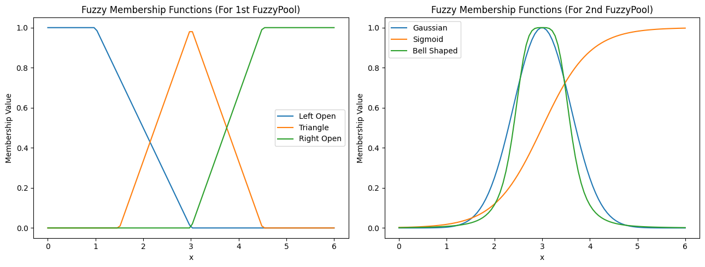
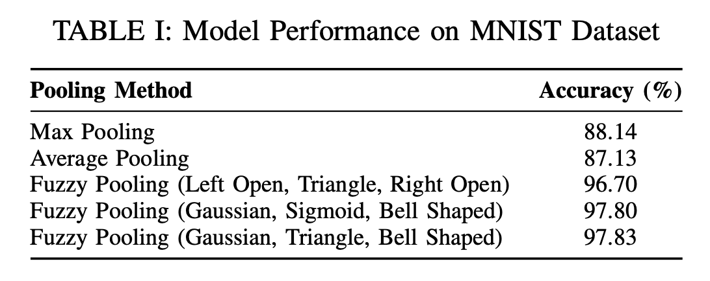

# Fuzzy Pooling in Neural Networks

This project explores and implements **Fuzzy Pooling** as a new approach to pooling in convolutional neural networks (CNNs). By introducing fuzziness to the pooling process, Fuzzy Pooling captures more nuanced information and retains important details often lost in traditional pooling methods like max pooling and average pooling. 

The goal is to compare Fuzzy Pooling’s effectiveness in feature retention and its impact on model performance against conventional pooling techniques, using different membership functions.

### Membership Functions
The following membership functions were tested in this project:
- **Left Open**, **Triangle**, **Right Open** (part of the paper)
- **Gaussian**, **Sigmoid**, **Bell-shaped** (experimentation)

## Methodology

The Fuzzy Pooling layer was implemented based on the paper by Dimitrios E. Diamantis and Dimitris K. Iakovidis, using:
1. **Membership Functions**: To evaluate each value’s degree of importance.
2. **Aggregation**: Combining values in the region based on importance levels.
3. **Defuzzification**: Converting the aggregated fuzzy values back into a usable numeric format.

A **LeNet-inspired CNN model** was used to evaluate the pooling methods on the **MNIST dataset**. The pooling strategies tested were:
- **Max Pooling**
- **Average Pooling**
- **Fuzzy Pooling** (with different membership functions)

## Results

The Fuzzy Pooling models demonstrated superior accuracy in comparison to max and average pooling, highlighting their capability to retain essential information:
- **Max Pooling**: 88.14% accuracy
- **Average Pooling**: 87.13% accuracy
- **Fuzzy Pooling**: Between 96.70% and 97.83% accuracy, depending on the membership function

Using center-focused membership functions yielded the best results, as these functions focus on the most informative pixels, especially useful in digit recognition tasks.

## References

- D. E. Diamantis and D. K. Iakovidis, "Fuzzy Pooling," *IEEE Transactions on Fuzzy Systems*, 2021. [DOI: 10.1109/TFUZZ.2020.3024023](https://doi.org/10.1109/TFUZZ.2020.3024023)
- L. Deng, "The MNIST Database of Handwritten Digit Images," *IEEE Signal Processing Magazine*, 2012. [DOI: 10.1109/MSP.2012.2211477](https://doi.org/10.1109/MSP.2012.2211477)
